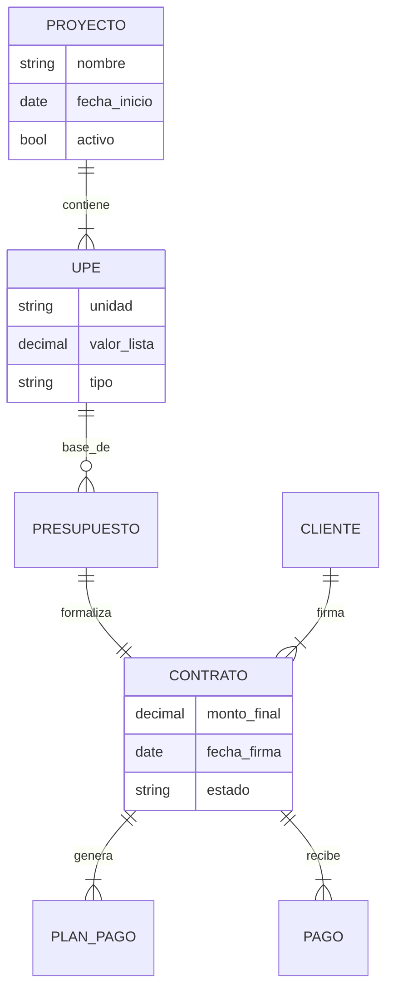
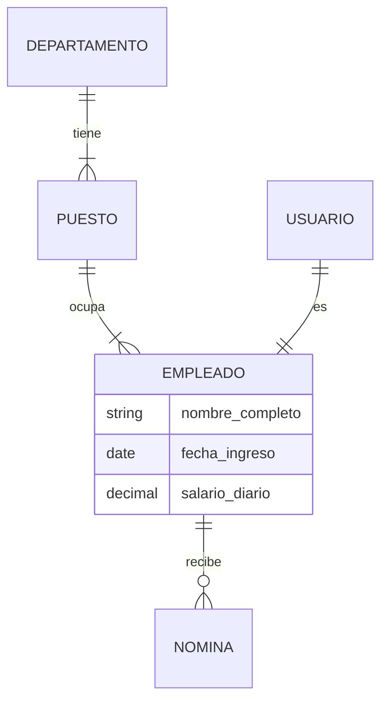

# 🗄 Base de Datos y Modelos

El sistema utiliza **PostgreSQL** como motor de base de datos relacional.

## 📊 Diagrama de Entidad-Relación (Simplificado)

### Módulo Financiero (Contabilidad)

### Módulo RRHH

## 📝 Convenciones de Modelos

1.  **Soft Delete (`activo=True/False`)**
    Todos los modelos críticos heredan de una clase base que implementa un campo `activo`. Al eliminar desde la UI, solo se marca como `False`.

2.  **Auditoría Automática**
    Django registra automáticamente `created_at` y `updated_at`. Adicionalmente, el middleware de auditoría registra el `user_id` que modificó el registro.

3.  **Vector Store (`pgvector`)**
    Las tablas pueden tener columnas vectoriales para búsqueda semántica (usado por el Chatbot de IA para encontrar información relevante en reportes).
